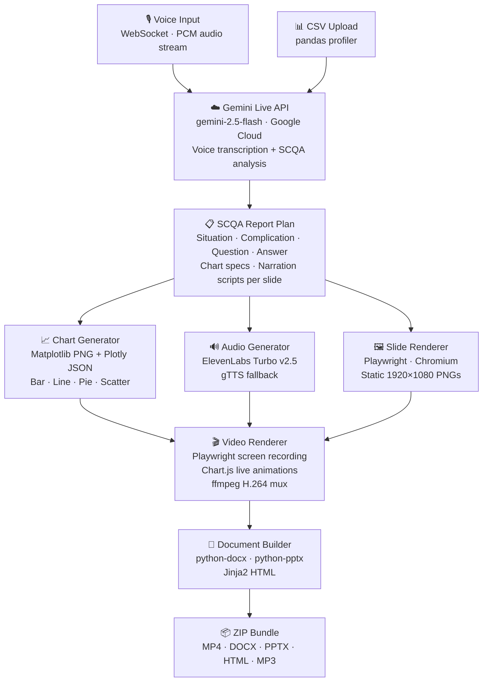

# CaseStudy Forge 🎙️ → 📊

> Upload a CSV. Speak your findings. Get a boardroom-ready report in minutes.

CaseStudy Forge is a voice-driven, multimodal business report generator built for the **Gemini Live Agent Challenge**. The core idea is simple: you should be able to talk about what you found in your data the way you'd explain it to a colleague, and have it come out the other side as a proper cinematic presentation — not a template-filled PowerPoint.

**What you get per session:** MP4 cinematic video · DOCX · PPTX · Interactive HTML · MP3 summary · ZIP bundle

---

## How It Works — Full Pipeline

The diagram below shows every step from your voice and CSV to the final output bundle. Each stage runs sequentially; if one stage fails it does not block the rest.



---

## Architecture Explained

### Stage 1 — Input

The user does two things to start a session:

- **Upload a CSV** — any structured data file (sales, finance, operations, HR). The `csv_parser.py` module profiles it with pandas, extracting column types, numeric statistics, sample rows, and cardinality. This profile is trimmed to fit the Gemini token budget.
- **Speak findings** — the frontend captures audio via the Web Audio API and streams PCM chunks over a WebSocket connection to the FastAPI backend. The `agent.py` module forwards these to the **Gemini Live API** in real time.

Voice is the critical differentiator here. The context, emphasis, and intent you speak into the prompt is information that column headers can never carry on their own.

---

### Stage 2 — Gemini Live API (Google Cloud)

**Model:** `gemini-2.5-flash`
**SDK:** `google-genai` Python SDK

The Gemini Live API does two jobs:

1. **Voice transcription** — bidirectional audio streaming session converts your spoken findings to text in real time. The transcript is saved to the session.

2. **SCQA analysis** — the CSV profile + transcript are sent to Gemini's content API with a structured system prompt. Gemini returns a full **SCQA report plan** as JSON:
   - `report_title`
   - `executive_summary`
   - `sections[]` — each with a title, narrative, chart spec, callout, and per-slide narration script
   - `conclusion`
   - `audio_summary_script`

The SCQA (Situation / Complication / Question / Answer) framework forces the AI to tell a story with the data rather than just list observations.

**Proof of Google Cloud API usage:** `backend/analysis.py` and `backend/agent.py`

---

### Stage 3 — Chart Generation

**Module:** `backend/chart_generator.py`
**Libraries:** Matplotlib, Plotly, kaleido

For each section in the report plan, Gemini specifies:
- Chart type (`bar`, `line`, `pie`, `scatter`)
- Which columns to use on each axis
- A grouping column if needed

`chart_generator.py` reads the original dataframe and generates:
- A **Matplotlib PNG** — used as a fallback in static outputs (DOCX, PPTX)
- A **Plotly JSON** — used by the video renderer and HTML report

The Plotly JSON is the key artifact here. The video renderer converts it to a **Chart.js config** at runtime, which means the chart animates live inside the Playwright-recorded video — bars grow up from zero, pie charts draw arc by arc, lines trace themselves left to right.

---

### Stage 4 — Audio Generation

**Module:** `backend/audio_summary.py`
**Primary:** ElevenLabs Turbo v2.5
**Fallback:** gTTS (Google Text-to-Speech)

One narration MP3 is generated per slide:
- `narration_00_cover.mp3` — executive summary narration
- `narration_01.mp3` through `narration_N.mp3` — per-section narrations (20–30 words each, taken from `slide_narration` in the report plan)
- `narration_conclusion.mp3` — conclusion narration

The pipeline uses gTTS by default during development to conserve the ElevenLabs free tier. Swapping to ElevenLabs requires only adding `ELEVENLABS_API_KEY` to `.env` — no code changes needed.

---

### Stage 5 — Slide Rendering

**Module:** `backend/slide_renderer.py`
**Tool:** Playwright (Chromium, via subprocess worker)

Each section's content is rendered as a 1920×1080 HTML page and screenshotted by Playwright. These PNGs are used in:
- The PPTX output (as slide images)
- As fallback frames in the video if Chart.js conversion fails

**Windows note:** Playwright runs via `subprocess.run` calling a separate `render_slide_worker.py` to work around the Windows `ProactorEventLoop` incompatibility with uvicorn's `SelectorEventLoop`.

---

### Stage 6 — Video Rendering

**Module:** `backend/video_renderer.py`
**Tools:** Playwright (screen recording), Chart.js (CDN), ffmpeg

This is the most technically interesting stage. Rather than rendering a video frame-by-frame in Python (which takes 20+ minutes at 1920×1080), the video is **recorded in real time** from a live animated HTML page.

The flow inside the video renderer:

1. **Build animated HTML** — a single self-contained HTML file is generated with all slides stacked as sections. Each slide contains:
   - A live Chart.js `<canvas>` element (converted from Plotly JSON) — bars animate on entry, pies draw, lines trace
   - CSS entrance animations — headlines slide up from 80px below, callouts wipe in from the left, charts scale in from center
   - Stat numbers that count up from 0 to their target value via JavaScript
   - A bioluminescent water background — floating cyan/teal gradient orbs with noise grain overlay
   - A cyan progress bar along the bottom

2. **Playwright records** — headless Chromium opens the HTML file with `record_video_dir` enabled. A JavaScript `setTimeout` chain auto-advances through slides while Playwright captures everything to a `.webm` file. The `--disable-gpu` flag is intentionally absent — CSS animations require GPU compositing to actually run.

3. **Audio sync** — `ffmpeg`'s `adelay` filter places each narration MP3 at the exact millisecond when its slide becomes visible, then `amix` merges all clips into one stereo audio track.

4. **Mux** — `ffmpeg` combines the `.webm` visuals and synced audio into a final H.264 MP4 with `yuv420p` pixel format (compatible with all players, LinkedIn, iOS).

**Why this approach:**
| Old approach (moviepy) | New approach (Playwright) |
|---|---|
| Per-frame Python resize | CSS GPU-composited animations |
| 20+ minutes for 90s video | ~Realtime (90s video = ~90s to record) |
| Static PNG charts | Live Chart.js — bars grow, pies draw |
| Ken Burns zoom on flat image | Independent element animations |

---

### Stage 7 — Document Builder

**Module:** `backend/report_docx.py`, `backend/report_pptx.py`, `backend/report_html.py`
**Libraries:** python-docx, python-pptx, Jinja2

Three static output formats are generated in parallel:
- **DOCX** — full narrative report with chart images embedded, section headings, callout boxes
- **PPTX** — slide deck with the palette applied, one slide per section, chart PNGs embedded
- **HTML** — interactive single-page report using Jinja2 templates with Plotly charts rendered inline

---

### Stage 8 — ZIP Bundle

All outputs (`presentation.mp4`, `report.docx`, `report.pptx`, `report.html`, `summary.mp3`) are bundled into a single `report_bundle.zip` for one-click download.

---

## Prerequisites

| Requirement | Version |
|---|---|
| Python | 3.12 |
| ffmpeg + ffprobe | Any recent build |
| Git | Any |

---

## Local Setup — Step by Step

### Step 1 — Clone the repo

```bash
git clone https://github.com/YOUR_USERNAME/casestudy-forge.git
cd casestudy-forge
```

### Step 2 — Create and activate a virtual environment

```bash
# Windows
python -m venv venv
venv\Scripts\activate

# macOS / Linux
python -m venv venv
source venv/bin/activate
```

### Step 3 — Install Python dependencies

```bash
cd backend
pip install -r requirements.txt
```

Key packages:
```
fastapi==0.111.0          # Web framework
uvicorn==0.29.0           # ASGI server
google-genai>=0.5.0       # Gemini Live API SDK
playwright==1.44.0        # Chromium screen recording
python-docx==1.1.2        # DOCX generation
python-pptx==0.6.23       # PPTX generation
pandas==2.2.2             # CSV profiling
matplotlib==3.9.0         # Chart PNG rendering
plotly==5.22.0            # Interactive chart JSON
kaleido==0.2.1            # Plotly static export
elevenlabs==1.2.0         # TTS narration
gTTS==2.5.1               # TTS fallback
Jinja2==3.1.4             # HTML templates
Pillow==10.3.0            # Image processing
ffmpeg-python==0.2.0      # ffmpeg bindings
python-dotenv==1.0.1      # .env loading
```

### Step 4 — Install Playwright's Chromium browser

```bash
playwright install chromium
```

### Step 5 — Install ffmpeg

**Windows (via winget):**
```bash
winget install ffmpeg
```
Restart your terminal, then verify:
```bash
ffmpeg -version
ffprobe -version
```

**macOS:**
```bash
brew install ffmpeg
```

**Ubuntu:**
```bash
sudo apt update && sudo apt install ffmpeg
```

### Step 6 — Configure environment variables

Create a `.env` file inside `backend/`:

```bash
# backend/.env

GEMINI_API_KEY=your_google_ai_studio_key_here
ELEVENLABS_API_KEY=your_elevenlabs_key_here   # optional — gTTS runs without it
OUTPUTS_DIR=outputs
UPLOADS_DIR=uploads
```

Get your free Gemini API key at: https://aistudio.google.com/app/apikey

### Step 7 — Enable long paths (Windows only)

Run PowerShell as Administrator:
```powershell
New-ItemProperty -Path "HKLM:\SYSTEM\CurrentControlSet\Control\FileSystem" `
  -Name "LongPathsEnabled" -Value 1 -PropertyType DWORD -Force
```

### Step 8 — Run the app

```bash
# Must be run from inside the backend/ directory
cd backend
uvicorn main:app --host 127.0.0.1 --port 8080 --reload
```

Open your browser at: **http://127.0.0.1:8080**

---

## How to Use

1. Click **Upload CSV** and select your data file
2. Click **Start Recording** and speak your findings naturally (20–60 seconds)
3. Click **Stop** then **Generate Report**
4. Wait 5–10 minutes for the full pipeline to complete
5. Download your ZIP bundle

---

## Sample Data

A pre-built dataset and transcript are included for testing:

```
sample_data/
├── sample_techco.csv        # 96-row SaaS revenue dataset
│                            # 4 regions · 4 products · 6 quarters
│                            # Designed to produce bar + line + pie charts
└── sample_findings.txt      # Pre-written transcript — paste into the voice box
```

Paste the contents of `sample_findings.txt` into the voice input box to skip the recording step during testing.

---

## Project Structure

```
casestudy-forge/
├── backend/
│   ├── main.py                  # FastAPI app — full 10-step generation pipeline
│   ├── agent.py                 # Gemini Live voice session handler
│   ├── analysis.py              # Gemini SCQA report plan generator ← Google Cloud API
│   ├── chart_generator.py       # Matplotlib + Plotly chart renderer
│   ├── audio_summary.py         # ElevenLabs / gTTS narration generator
│   ├── slide_renderer.py        # Playwright static slide PNG renderer
│   ├── render_slide_worker.py   # Subprocess worker (Windows ProactorEventLoop fix)
│   ├── video_renderer.py        # Playwright screen recording + Chart.js video
│   ├── report_docx.py           # python-docx DOCX builder
│   ├── report_pptx.py           # python-pptx PPTX builder
│   ├── report_html.py           # Jinja2 HTML report builder
│   ├── csv_parser.py            # pandas CSV profiler
│   ├── session_store.py         # In-memory session state
│   ├── templates/               # Jinja2 HTML templates
│   └── requirements.txt
├── frontend/
│   ├── index.html               # Single-page UI
│   └── audio_processor.js       # Web Audio worklet for PCM streaming
├── sample_data/
│   ├── sample_techco.csv
│   └── sample_findings.txt
├── .env.example
└── README.md
```

---

## Google Cloud Services

| Service | Where used |
|---|---|
| **Gemini Live API** (`gemini-2.5-flash`) | `backend/agent.py` — bidirectional voice streaming |
| **Gemini Content API** (`gemini-2.5-flash`) | `backend/analysis.py` — SCQA report plan generation |
| **Google AI Studio** | API key provisioning |

---

## Generation Pipeline Steps

| Step | What happens | Key file |
|---|---|---|
| 1 | Profile CSV with pandas | `csv_parser.py` |
| 2 | Trim profile to fit token budget | `main.py` |
| 3 | Call Gemini Live API → SCQA report plan | `analysis.py` |
| 4 | Gemini response received | — |
| 5 | Generate charts (Matplotlib PNG + Plotly JSON) | `chart_generator.py` |
| 6 | Generate per-slide narration audio | `audio_summary.py` |
| 7 | Render static slide PNGs via Playwright | `slide_renderer.py` |
| 8 | Record animated video via Playwright screen recording | `video_renderer.py` |
| 9 | Build DOCX + PPTX + HTML + MP3 | `report_*.py` |
| 10 | Bundle ZIP | `main.py` |

---

## Troubleshooting

**`Could not import module "main"`**
You are running uvicorn from the project root. Run it from inside `backend/` instead:
```bash
cd backend
uvicorn main:app --host 127.0.0.1 --port 8080 --reload
```

**`NotImplementedError` from Playwright on Windows**
Already fixed in `video_renderer.py` — Playwright runs in a dedicated `ProactorEventLoop` thread. If it still appears, make sure you replaced the full file contents.

**`ffmpeg returned non-zero exit status`**
ffmpeg is not on your PATH. Run `ffmpeg -version` in your terminal to check. If not found, reinstall via `winget install ffmpeg` and restart your terminal.

**Video renders but no animations visible**
Make sure `--disable-gpu` is not present in the Playwright launch args in `video_renderer.py`. GPU compositing is required for CSS `@keyframes` and `transition` to execute during recording.

**Charts missing from video (only PNG shows)**
Install kaleido: `pip install kaleido==0.2.1`. Without it, Plotly JSON may not be generated correctly.

**ElevenLabs not working**
The pipeline silently falls back to gTTS if `ELEVENLABS_API_KEY` is missing or the request fails. The video will still generate with gTTS narration.

---

## Tech Stack Summary

```
AI / API        Gemini Live API (gemini-2.5-flash) · ElevenLabs Turbo v2.5 · gTTS
Backend         FastAPI · Python 3.12 · Uvicorn
Recording       Playwright (Chromium screen recording)
Animations      Chart.js · CSS keyframes · JavaScript
Charts          Plotly · Matplotlib
Video           ffmpeg (adelay mux · H.264 mux · minterpolate smoothing)
Documents       python-docx · python-pptx · Jinja2
Data            pandas · Pydantic
```